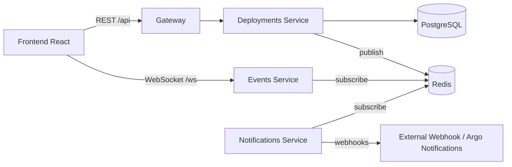

# Architecture

## Observability

- `/metrics` on each backend service exposed through Prometheus `ServiceMonitor`.
- OpenTelemetry middleware hooks in Gin services.
- JSON structured logging using `slog`.

## Security and delivery

- Istio Gateway + VirtualService + DestinationRule for traffic management.
- Argo Rollouts for canary and blue/green progressive delivery.
- cert-manager certificate for ingress TLS.
- Gatekeeper constraints to enforce baseline workload controls.
- Calico network policies for east-west traffic restrictions.
